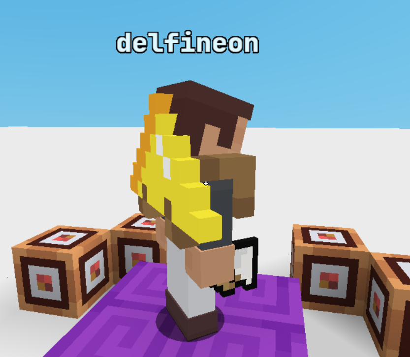
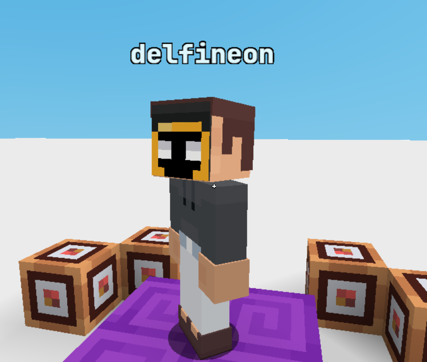
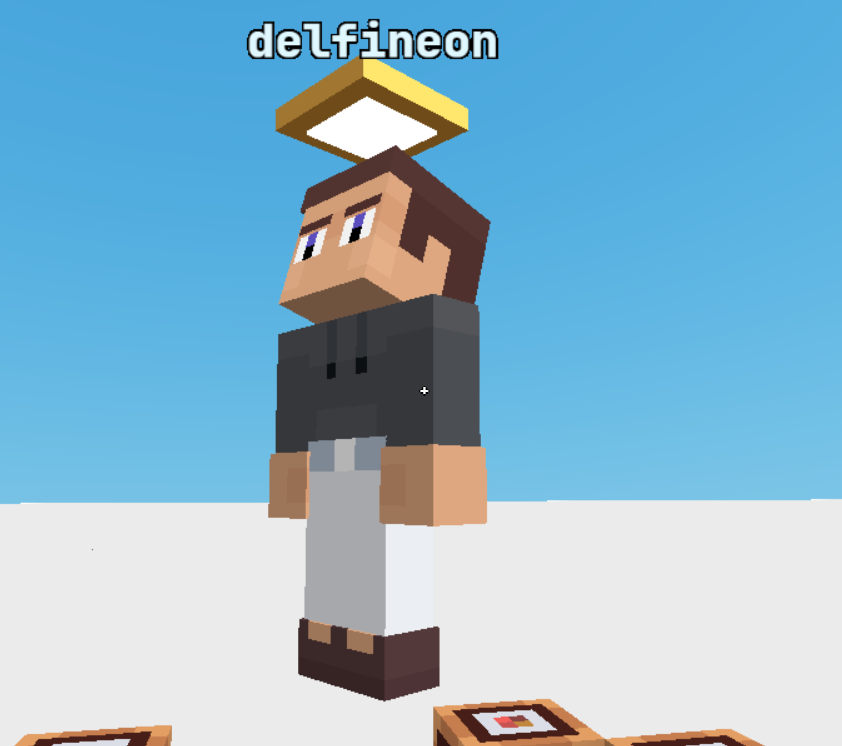
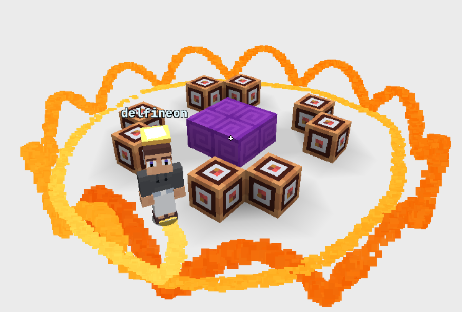

---

<div align="center">
  <h1>ENTITY MESHES</h1>
  <p>
    <a href="#api-methods"><kbd>API Methods</kbd></a> &nbsp;•&nbsp;
    <a href="#scale-nodes"><kbd>Scale Nodes</kbd></a> &nbsp;•&nbsp;
    <a href="#node-attachments"><kbd>Node Attachments</kbd></a> &nbsp;•&nbsp;
    <a href="#bloxdblock"><kbd>BloxdBlock</kbd></a> &nbsp;•&nbsp;
    <a href="#box"><kbd>Box</kbd></a> &nbsp;•&nbsp;
    <a href="#particleemitter"><kbd>ParticleEmitter</kbd></a> &nbsp;•&nbsp;
    <a href="#person"><kbd>Person</kbd></a>
  </p>
</div>

<div align="center">
  <h4>
    ✦ <code><b>Credits</b></code> ✦<br>
    <b>Information was extracted and compiled by <code>delfineonx</code></b>
  </h4>
</div>

---

<a id="api-methods"></a>
<details open>
  <summary>
    <div align="center">
      <h2>❮ <code><b>API Methods</b></code> ❯</h2>
    </div>
  </summary>

```js
/**
 * Scale node of a lifeform's mesh by 3d vector.
 * State from prior calls to this api is lost, so if you want to have multiple nodes scaled, pass in all the scales at once.
 *
 * @param {LifeformId} lifeformId - player or mob
 * @param {EntityMeshScalingMap} nodeScales
 * @returns {void}
 */
api.scalePlayerMeshNodes(lifeformId, nodeScales);
```

```js
/**
 * Attach/detach a mesh instance to/from a specific node of an entity (player / mob).
 *
 * @param {EntityId} entityId
 * @param {EntityNamedNode} node
 * @param {MeshType | null} type - if `null`, detaches mesh from this node.
 * @param {MeshEntityOptions[MeshType]} [options]
 * @param {[number, number, number]} [offset] - Applied in node-local space.
 * @param {[number, number, number]} [rotation] - Euler rotation in radians (XYZ), applied in node-local space.
 * @returns {void}
 */
api.updateEntityNodeMeshAttachment(entityId, node, type, options, offset, rotation);
```

</details>

---

<a id="scale-nodes"></a>
<details open>
  <summary>
    <div align="center">
      <h2>❮ <code><b>Scale Nodes</b></code> ❯</h2>
    </div>
  </summary>

<div align="left">
  <h3>〔 <code><b>Usage</b></code> 〕</h3>
</div>

<div align="left">
  <h4>⊂ <code><b>Apply Scaling</b></code> ⊃</h4>
</div>

```js
api.scalePlayerMeshNodes(playerId, {
  TorsoNode: [1.0, 1.0, 1.0],
  HeadMesh: [2.0, 2.0, 2.0],
  ArmLeftMesh: [0.5, 0.5, 0.5],
  ArmRightMesh: [0.5, 0.5, 0.5],
  LegLeftMesh: [1.0, 1.5, 1.0],
  LegRightMesh: [1.0, 1.5, 1.0],
});
```

<div align="left">
  <h4>⊂ <code><b>Clear Scaling</b></code> ⊃</h4>
</div>

```js
// Passing an empty map effectively clears all nodes scaling
api.scalePlayerMeshNodes(playerId, {});
```

<div align="left">
  <h3>〔 <code><b>Reference</b></code> 〕</h3>
</div>

```ts
type EntityNamedNode = HumanoidNamedNode | FourLeggedNamedNode;
type HumanoidNamedNode = "TorsoNode" | "HeadMesh" | "ArmRightMesh" | "ArmLeftMesh" | "LegLeftMesh" | "LegRightMesh";
type FourLeggedNamedNode = "HeadMesh";
```

```ts
type EntityMeshScalingMap = Partial< Record<EntityNamedNode, [number, number, number]> >;
```

</details>

---

<a id="node-attachments"></a>
<details open>
  <summary>
    <div align="center">
      <h2>❮ <code><b>Node Attachments</b></code> ❯</h2>
    </div>
  </summary>

<div align="left">
  <h3>〔 <code><b>Detach / Remove</b></code> 〕</h3>
</div>

```js
/**
 * Attach/detach a mesh instance to/from a specific node of an entity (player / mob).
 *
 * @param {EntityId} entityId
 * @param {EntityNamedNode} node
 * @returns {void}
 */
api.updateEntityNodeMeshAttachment(entityId, node, null);
```

<div align="left">
  <h3>〔 <code><b>Reference</b></code> 〕</h3>
</div>

```ts
type Vec3 = [number, number, number];
type Vec4 = [number, number, number, number];
```

```ts
type EntityNamedNode = HumanoidNamedNode | FourLeggedNamedNode;
type HumanoidNamedNode = "TorsoNode" | "HeadMesh" | "ArmRightMesh" | "ArmLeftMesh" | "LegLeftMesh" | "LegRightMesh";
type FourLeggedNamedNode = "HeadMesh";
```

```ts
type MeshType = "BloxdBlock" | "Box" | "ParticleEmitter" | "Person";

type MeshEntityOptions = {
  BloxdBlock: BloxdBlockOptions;
  Box: BoxOptions;
  ParticleEmitter: ParticleEmitterOptions;
  Person: PersonOptions;
};
```

</details>

---

<a id="bloxdblock"></a>
<details open>
  <summary>
    <div align="center">
      <h2>❮ <code><b>BloxdBlock</b></code> ❯</h2>
    </div>
  </summary>

<div align="left">
  <h3>〔 <code><b>Usage</b></code> 〕</h3>
</div>

```js
api.updateEntityNodeMeshAttachment(
  playerId,
  "TorsoNode",
  "BloxdBlock",
  {
    blockName: "INTERNAL_MESH_Gold Hang Glider",
    size: 3,
  },
  [0, 0.72, 0.3],
  [-Math.PI / 2, Math.PI, Math.PI]
);
```

<div align="center">
  
</div>

<div align="left">
  <h3>〔 <code><b>Reference</b></code> 〕</h3>
</div>

```ts
type BloxdBlockOptions = {
  // any item name
  blockName: string;

  // scale factor for the item mesh
  size: number;

  // NOTE (client behavior):
  // `meshOffset` is tracked internally, but does NOT reliably produce a visible change via API.
  // If omitted, the client defaults to [0, size/2, 0].
  meshOffset?: Vec3;
};
```

</details>

---

<a id="box"></a>
<details open>
  <summary>
    <div align="center">
      <h2>❮ <code><b>Box</b></code> ❯</h2>
    </div>
  </summary>

<div align="left">
  <h3>〔 <code><b>Usage</b></code> 〕</h3>
</div>

<div align="left">
  <h4>⊂ <code><b>Textured</b></code> ⊃</h4>
</div>

```js
api.updateEntityNodeMeshAttachment(
  playerId,
  "HeadMesh",
  "Box",
  {
    texture: "shop_trader_spawn_face",
    width: 0.56,
    height: 0.56,
    depth: 0.56,
  },
  [0, 0.28, 0.03],
  [0, 0, 0]
);
```

<div align="center">
  
</div>

<div align="left">
  <h4>⊂ <code><b>Solid-Colored</b></code> ⊃</h4>
</div>

```js
mobId = api.attemptSpawnMob("Draugr Huntress", ...api.getPosition(playerId), { spawnerId: playerId });

const config = [
  "idleSound", null,
  "onDeathItemDrops", [],
  "onDeathAura", 0,
  "baseWalkingSpeed", 0,
  "baseRunningSpeed", 0,
  "baseJumpImpulseXZ", 0,
  "baseJumpImpulseY", 0,
  "chaseRadius", 0,
  "hostilityRadius", 0,
  "attackInterval", 1e9,
  "attackRadius", 0,
  "attackDamage", 0,
  "attackImpulse", 0,
  "attackEffectName", null,
  "attackEffectDuration", 0,
];
for (let i = 0, n = config.length; i < n; i += 2) {
  api.setMobSetting(mobId, config[i], config[i + 1]);
}

api.setHealth(mobId, 1e9, undefined, true);
api.setTargetedPlayerSettingForEveryone(mobId, "canAttack", false, true);
api.setTargetedPlayerSettingForEveryone(mobId, "opacity", 0.01, true);

api.addFollowingEntityToPlayer(playerId, mobId, [0, 0, 0]);
```

```js
// on the next tick

api.setTargetedPlayerSettingForEveryone(playerId, "nameTagInfo", {
  backgroundColor: "transparent",
  subtitle: [{ str: "", style: { fontSize: "48px" } }],
  subtitleBackgroundColor: "transparent",
}, true);

api.applyEffect(mobId, "Invisible", null, { inbuiltLevel: 1 });

api.updateEntityNodeMeshAttachment(
  mobId,
  "HeadMesh",
  "Box",
  {
    diffuseColor: [245, 210, 115],
    emissiveColor: [110, 75, 25],
    backFaceCulling: false,
    width: 0.60,
    height: 0.10,
    depth: 0.60,
  },
  [0, 0.9, 0],
  [0, 0, 0]
);

api.updateEntityNodeMeshAttachment(
  mobId,
  "TorsoNode",
  "Box",
  {
    diffuseColor: [255, 255, 255],
    emissiveColor: [255, 255, 255],
    backFaceCulling: false,
    width: 0.40,
    height: 0.14,
    depth: 0.40,
  },
  [0, 1.62, 0],
  [0, 0, 0]
);
```

<div align="center">
  
</div>

<div align="left">
  <h3>〔 <code><b>Reference</b></code> 〕</h3>
</div>

```ts
type BoxOptions = {
  /**
   * Two "modes":
   * 1) Solid-color: provide `diffuseColor` AND `emissiveColor`.
   * 2) Textured: omit `diffuseColor` and provide `texture`.
   */

  // solid-color (0..255)
  diffuseColor?: Vec3;
  emissiveColor?: Vec3;

  // textured (treated as BLOCK texture; see `Block Textures`).
  texture?: string;

  // client default: true
  backFaceCulling?: boolean;

  // box dimensions
  width: number;
  height: number;
  depth: number;

  // optional UVs per face:
  // 6 faces, each face is [u0, v0, u1, v1] in [0..1].
  faceUV?: [Vec4, Vec4, Vec4, Vec4, Vec4, Vec4];
};
```

  <details>
    <summary>
      <div align="left">
        <h3>〔 <code><b>Block Textures</b></code> 〕</h3>
      </div>
    </summary>

```js
"allium"
"andesite_brick"
"apple_block_bottom"
"apple_block_side"
"apple_block_top"
"artisan_table_side"
"artisan_table_top"
"aspen_door_bottom"
"aspen_door_top"
"aspen_sapling"
"attached_banana_stem"
"attached_banana_stem_wrapper"
"attached_melon_stem"
"attached_melon_stem_wrapper"
"autumn_fern"
"azure_bluet"
"banana_block_bottom"
"banana_block_side"
"banana_block_top"
"banana_stem"
"beacon"
"bedrock"
"beetroot_block_bottom"
"beetroot_block_side"
"beetroot_block_top"
"beetroot_plant_stage0"
"beetroot_plant_stage1"
"beetroot_plant_stage2"
"berry_bush_stage0"
"berry_bush_stage1"
"berry_bush_stage2"
"black_concrete"
"black_glazed_terracotta"
"black_planks"
"black_portal0"
"black_portal1"
"black_portal2"
"black_portal3"
"black_spawn_block_side"
"black_spawn_block_top"
"black_stained_glass"
"blue_concrete"
"blue_gen_spawn_coal"
"blue_gen_spawn_iron"
"blue_gen_spawn_top"
"blue_glazed_terracotta"
"blue_orchid"
"blue_planks"
"blue_portal0"
"blue_portal1"
"blue_portal2"
"blue_portal3"
"blue_spawn_block_side"
"blue_spawn_block_top"
"blueberry_bush_stage0"
"blueberry_bush_stage1"
"blueberry_bush_stage2"
"board_full"
"bone_block_side"
"bone_block_top"
"bookshelf"
"bookshelf_1"
"bookshelf_2"
"bookshelf_3"
"bookshelf_4"
"bookshelf_5"
"bookshelf_empty"
"bouncy_bomb_block"
"bread_block_back"
"bread_block_front"
"bread_block_side"
"bread_block_top"
"brick"
"brown_concrete"
"brown_glazed_terracotta"
"brown_mushroom"
"brown_mushroom_block"
"brown_planks"
"brown_portal0"
"brown_portal1"
"brown_portal2"
"brown_portal3"
"brown_spawn_block_side"
"brown_spawn_block_top"
"cactus_dry"
"cactus_side"
"cactus_top"
"carrot_block_bottom"
"carrot_block_side"
"carrot_block_top"
"carrot_plant_stage0"
"carrot_plant_stage1"
"carrot_plant_stage2"
"carved_messy_stone"
"carved_pumpkin"
"catnip"
"cauliflower_plant_stage0"
"cauliflower_plant_stage1"
"cauliflower_plant_stage2"
"cedar_door_bottom"
"cedar_door_top"
"cedar_sapling"
"chalk"
"chalk_black"
"chalk_blue"
"chalk_bricks_black"
"chalk_bricks_blue"
"chalk_bricks_brown"
"chalk_bricks_cyan"
"chalk_bricks_gray"
"chalk_bricks_green"
"chalk_bricks_light_blue"
"chalk_bricks_light_gray"
"chalk_bricks_lime"
"chalk_bricks_magenta"
"chalk_bricks_orange"
"chalk_bricks_pink"
"chalk_bricks_purple"
"chalk_bricks_red"
"chalk_bricks_slab_side_black"
"chalk_bricks_slab_side_blue"
"chalk_bricks_slab_side_brown"
"chalk_bricks_slab_side_cyan"
"chalk_bricks_slab_side_gray"
"chalk_bricks_slab_side_green"
"chalk_bricks_slab_side_light_blue"
"chalk_bricks_slab_side_light_gray"
"chalk_bricks_slab_side_lime"
"chalk_bricks_slab_side_magenta"
"chalk_bricks_slab_side_orange"
"chalk_bricks_slab_side_pink"
"chalk_bricks_slab_side_purple"
"chalk_bricks_slab_side_red"
"chalk_bricks_slab_side_white"
"chalk_bricks_slab_side_yellow"
"chalk_bricks_white"
"chalk_bricks_yellow"
"chalk_brown"
"chalk_cyan"
"chalk_gray"
"chalk_green"
"chalk_light_blue"
"chalk_light_gray"
"chalk_lime"
"chalk_magenta"
"chalk_orange"
"chalk_pink"
"chalk_purple"
"chalk_red"
"chalk_white"
"chalk_yellow"
"checkpoint_block"
"cherry_block_bottom"
"cherry_block_side"
"cherry_block_top"
"cherry_door_bottom"
"cherry_door_top"
"cherry_sapling"
"chest_back"
"chest_front"
"chest_side"
"chest_top_1"
"chest_top_2"
"chili_pepper_block_bottom"
"chili_pepper_block_side"
"chili_pepper_block_top"
"chiseled_red_sandstone"
"chiseled_sandstone"
"clay"
"coal_block"
"coal_ore"
"coarse_dirt"
"cobblestone_mossy"
"cobweb"
"coconut_block_bottom"
"coconut_block_side"
"coconut_block_top"
"code_block"
"coffee_plant_stage0"
"coffee_plant_stage1"
"coffee_plant_stage2"
"compressed_messy_stone"
"corn_block_bottom"
"corn_block_side"
"corn_block_top"
"corn_stage0"
"corn_stage1"
"corn_stage2"
"corn_stage3"
"corn_stage4"
"corn_stage5"
"cornflower"
"cotton_plant_stage0"
"cotton_plant_stage1"
"cotton_plant_stage2"
"cotton_plant_stage3"
"crafting_table_side"
"crafting_table_top"
"crate"
"custom_lobby_block_side"
"custom_lobby_block_top"
"cut_red_sandstone"
"cut_sandstone"
"cyan_concrete"
"cyan_gen_spawn_coal"
"cyan_gen_spawn_iron"
"cyan_gen_spawn_top"
"cyan_glazed_terracotta"
"cyan_planks"
"cyan_portal0"
"cyan_portal1"
"cyan_portal2"
"cyan_portal3"
"cyan_spawn_block_side"
"cyan_spawn_block_top"
"dandelion"
"dark_green_bricks"
"destroy_stage_0"
"destroy_stage_1"
"destroy_stage_2"
"destroy_stage_3"
"destroy_stage_4"
"destroy_stage_5"
"destroy_stage_6"
"destroy_stage_7"
"destroy_stage_8"
"destroy_stage_9"
"diamond_block"
"diamond_gen_spawn_side"
"diamond_gen_spawn_top"
"diamond_ore"
"diorite_brick"
"dirt"
"drop_location_block_side"
"drop_location_block_top"
"emerald_block"
"emerald_ore"
"end_stone"
"engraved_andesite"
"engraved_diorite"
"engraved_granite"
"explosive_paint_black_side"
"explosive_paint_black_top"
"explosive_paint_blue_side"
"explosive_paint_blue_top"
"explosive_paint_brown_side"
"explosive_paint_brown_top"
"explosive_paint_cyan_side"
"explosive_paint_cyan_top"
"explosive_paint_gray_side"
"explosive_paint_gray_top"
"explosive_paint_green_side"
"explosive_paint_green_top"
"explosive_paint_light_blue_side"
"explosive_paint_light_blue_top"
"explosive_paint_light_gray_side"
"explosive_paint_light_gray_top"
"explosive_paint_lime_side"
"explosive_paint_lime_top"
"explosive_paint_magenta_side"
"explosive_paint_magenta_top"
"explosive_paint_orange_side"
"explosive_paint_orange_top"
"explosive_paint_pink_side"
"explosive_paint_pink_top"
"explosive_paint_purple_side"
"explosive_paint_purple_top"
"explosive_paint_quick_black"
"explosive_paint_quick_blue"
"explosive_paint_quick_brown"
"explosive_paint_quick_cyan"
"explosive_paint_quick_gray"
"explosive_paint_quick_green"
"explosive_paint_quick_light_blue"
"explosive_paint_quick_light_gray"
"explosive_paint_quick_lime"
"explosive_paint_quick_magenta"
"explosive_paint_quick_orange"
"explosive_paint_quick_pink"
"explosive_paint_quick_purple"
"explosive_paint_quick_red"
"explosive_paint_quick_white"
"explosive_paint_quick_yellow"
"explosive_paint_red_side"
"explosive_paint_red_top"
"explosive_paint_seeking_black"
"explosive_paint_seeking_blue"
"explosive_paint_seeking_brown"
"explosive_paint_seeking_cyan"
"explosive_paint_seeking_gray"
"explosive_paint_seeking_green"
"explosive_paint_seeking_light_blue"
"explosive_paint_seeking_light_gray"
"explosive_paint_seeking_lime"
"explosive_paint_seeking_magenta"
"explosive_paint_seeking_orange"
"explosive_paint_seeking_pink"
"explosive_paint_seeking_purple"
"explosive_paint_seeking_red"
"explosive_paint_seeking_white"
"explosive_paint_seeking_yellow"
"explosive_paint_sticky_black"
"explosive_paint_sticky_blue"
"explosive_paint_sticky_brown"
"explosive_paint_sticky_cyan"
"explosive_paint_sticky_gray"
"explosive_paint_sticky_green"
"explosive_paint_sticky_light_blue"
"explosive_paint_sticky_light_gray"
"explosive_paint_sticky_lime"
"explosive_paint_sticky_magenta"
"explosive_paint_sticky_orange"
"explosive_paint_sticky_pink"
"explosive_paint_sticky_purple"
"explosive_paint_sticky_red"
"explosive_paint_sticky_white"
"explosive_paint_sticky_yellow"
"explosive_paint_white_side"
"explosive_paint_white_top"
"explosive_paint_yellow_side"
"explosive_paint_yellow_top"
"extra_compressed_messy_stone"
"fallen_cherry_leaves_side"
"fallen_maple_leaves_side"
"fallen_pine_cone"
"farmland"
"fertilised_soil"
"finish_block"
"fireball_block"
"furnace_front"
"furnace_side"
"furnace_top"
"glass"
"glass_black"
"glass_blue"
"glass_brown"
"glass_cyan"
"glass_gray"
"glass_green"
"glass_light_blue"
"glass_light_gray"
"glass_lime"
"glass_magenta"
"glass_orange"
"glass_pink"
"glass_purple"
"glass_red"
"glass_silver"
"glass_white"
"glass_yellow"
"glowstone"
"gold_block"
"gold_ore"
"granite_brick"
"grass_top"
"gravel"
"gray_concrete"
"gray_gen_spawn_coal"
"gray_gen_spawn_iron"
"gray_gen_spawn_top"
"gray_glazed_terracotta"
"gray_planks"
"gray_portal0"
"gray_portal1"
"gray_portal2"
"gray_portal3"
"gray_spawn_block_side"
"gray_spawn_block_top"
"green_bricks"
"green_concrete"
"green_glazed_terracotta"
"green_planks"
"green_portal0"
"green_portal1"
"green_portal2"
"green_portal3"
"green_spawn_block_side"
"green_spawn_block_top"
"green_stone"
"grenade_block"
"grey_portal0"
"grey_portal1"
"grey_portal2"
"grey_portal3"
"hardened_clay"
"hardened_clay_stained_black"
"hardened_clay_stained_blue"
"hardened_clay_stained_brown"
"hardened_clay_stained_cyan"
"hardened_clay_stained_gray"
"hardened_clay_stained_green"
"hardened_clay_stained_light_blue"
"hardened_clay_stained_lime"
"hardened_clay_stained_magenta"
"hardened_clay_stained_orange"
"hardened_clay_stained_pink"
"hardened_clay_stained_purple"
"hardened_clay_stained_red"
"hardened_clay_stained_silver"
"hardened_clay_stained_white"
"hardened_clay_stained_yellow"
"hay_block_side"
"hay_block_top"
"hyper_compressed_messy_stone"
"ice"
"ice_brick"
"iceball_block"
"invisible_solid"
"iron_block"
"iron_chest_back"
"iron_chest_bottom"
"iron_chest_front"
"iron_chest_side"
"iron_chest_top_1"
"iron_chest_top_2"
"iron_ore"
"iron_watermelon_side"
"iron_watermelon_top"
"jungle_door_bottom"
"jungle_door_top"
"jungle_grass_block"
"jungle_sapling"
"jungle_tall_grass_bottom"
"jungle_tall_grass_top"
"lapis_block"
"lapis_ore"
"lava0"
"lava1"
"lava2"
"lava3"
"lava4"
"lava5"
"lava6"
"lava7"
"leather_block_side"
"leather_block_top"
"leaves_aspen"
"leaves_aspen_autumn"
"leaves_cedar"
"leaves_cherry"
"leaves_cherry_fruity"
"leaves_jungle"
"leaves_mango"
"leaves_mango_fruity"
"leaves_maple"
"leaves_maple_autumn"
"leaves_maple_fruity"
"leaves_palm"
"leaves_palm_fruity"
"leaves_pear"
"leaves_pear_fruity"
"leaves_pine"
"leaves_pine_cone"
"leaves_plum"
"leaves_plum_fruity"
"leaves_spectral"
"lettuce_plant_stage0"
"lettuce_plant_stage1"
"lettuce_plant_stage2"
"light_blue_concrete"
"light_blue_glazed_terracotta"
"light_blue_planks"
"light_blue_spawn_block_side"
"light_blue_spawn_block_top"
"light_gray_concrete"
"light_gray_glazed_terracotta"
"light_gray_planks"
"light_gray_spawn_block_side"
"light_gray_spawn_block_top"
"light_gray_stained_glass"
"lightblue_portal0"
"lightblue_portal1"
"lightblue_portal2"
"lightblue_portal3"
"lightgray_portal0"
"lightgray_portal1"
"lightgray_portal2"
"lightgray_portal3"
"lily_of_the_valley"
"lime_concrete"
"lime_gen_spawn_coal"
"lime_gen_spawn_iron"
"lime_gen_spawn_top"
"lime_glazed_terracotta"
"lime_planks"
"lime_portal0"
"lime_portal1"
"lime_portal2"
"lime_portal3"
"lime_spawn_block_side"
"lime_spawn_block_top"
"log_aspen"
"log_cedar"
"log_cherry"
"log_jungle"
"log_mango"
"log_maple"
"log_palm"
"log_pear"
"log_pine"
"log_plum"
"log_spectral"
"lucky_block"
"magenta_concrete"
"magenta_glazed_terracotta"
"magenta_planks"
"magenta_portal0"
"magenta_portal1"
"magenta_portal2"
"magenta_portal3"
"magenta_spawn_block_side"
"magenta_spawn_block_top"
"magma"
"mailbox_front"
"mailbox_front_full"
"mailbox_side"
"mango_block_bottom"
"mango_block_side"
"mango_block_top"
"mango_door_bottom"
"mango_door_top"
"mango_sapling"
"maple_door_bottom"
"maple_door_top"
"maple_sapling"
"mega_compressed_messy_stone"
"melon_side"
"melon_stem"
"melon_top"
"melting_ice"
"messy_stone"
"mob_spawner_block_empty_side"
"mob_spawner_block_top"
"mob_spawner_hostile_block_side"
"mob_spawner_neutral_block_side"
"mob_spawner_passive_block_side"
"moonstone_block"
"moonstone_chest_back"
"moonstone_chest_bottom"
"moonstone_chest_front"
"moonstone_chest_side"
"moonstone_chest_top_1"
"moonstone_chest_top_2"
"moonstone_explosive_side"
"moonstone_explosive_top"
"moonstone_gen_spawn_side"
"moonstone_gen_spawn_top"
"moonstone_ore"
"mossy_cobblestone"
"mushroom_stem"
"mystery_block"
"net"
"nether_brick"
"netherrack"
"obby_absorb_block"
"obby_absorb_death_block"
"obby_death_block"
"obsidian"
"orange_concrete"
"orange_glazed_terracotta"
"orange_planks"
"orange_portal0"
"orange_portal1"
"orange_portal2"
"orange_portal3"
"orange_spawn_block_side"
"orange_spawn_block_top"
"orange_tulip"
"ore_gen_spawn_side"
"ore_gen_spawn_top"
"oxeye_daisy"
"packed_snow"
"palm_door_bottom"
"palm_door_top"
"palm_sapling"
"parsnip_plant_stage0"
"parsnip_plant_stage1"
"parsnip_plant_stage2"
"patterned_glass_black"
"patterned_glass_blue"
"patterned_glass_brown"
"patterned_glass_cyan"
"patterned_glass_gray"
"patterned_glass_green"
"patterned_glass_light_blue"
"patterned_glass_light_gray"
"patterned_glass_lime"
"patterned_glass_magenta"
"patterned_glass_orange"
"patterned_glass_pink"
"patterned_glass_purple"
"patterned_glass_red"
"patterned_glass_white"
"patterned_glass_yellow"
"pear_block_bottom"
"pear_block_side"
"pear_block_top"
"pear_door_bottom"
"pear_door_top"
"pear_sapling"
"pine_cone_block_side"
"pine_cone_block_top"
"pine_door_bottom"
"pine_door_top"
"pine_fern"
"pine_grass"
"pine_grass_block"
"pine_sapling"
"pink_concrete"
"pink_gen_spawn_coal"
"pink_gen_spawn_iron"
"pink_gen_spawn_top"
"pink_glazed_terracotta"
"pink_planks"
"pink_portal0"
"pink_portal1"
"pink_portal2"
"pink_portal3"
"pink_spawn_block_side"
"pink_spawn_block_top"
"pink_tulip"
"planks_aspen"
"planks_cedar"
"planks_cherry"
"planks_jungle"
"planks_mango"
"planks_maple"
"planks_palm"
"planks_pear"
"planks_pine"
"planks_plum"
"planks_spectral"
"plant_cacti_by_arthur"
"plum_block_bottom"
"plum_block_side"
"plum_block_top"
"plum_door_bottom"
"plum_door_top"
"plum_sapling"
"podzol_top"
"poppy"
"potato_block"
"potato_plant_stage0"
"potato_plant_stage1"
"potato_plant_stage2"
"protector"
"protector_faction"
"protector_tribe"
"pumpkin_face_on"
"pumpkin_side"
"pumpkin_top"
"purple_concrete"
"purple_glazed_terracotta"
"purple_planks"
"purple_portal0"
"purple_portal1"
"purple_portal2"
"purple_portal3"
"purple_spawn_block_side"
"purple_spawn_block_top"
"quartz_block_chiseled"
"quartz_block_side"
"radar_bottom"
"radar_screen0"
"radar_screen1"
"radar_screen2"
"radar_screen3"
"radar_side_active"
"radar_side_inactive"
"radar_top_active"
"radar_top_inactive"
"red_cabbage_stage0"
"red_cabbage_stage1"
"red_cabbage_stage2"
"red_concrete"
"red_gen_spawn_coal"
"red_gen_spawn_iron"
"red_gen_spawn_top"
"red_glazed_terracotta"
"red_mushroom"
"red_mushroom_block"
"red_planks"
"red_portal0"
"red_portal1"
"red_portal2"
"red_portal3"
"red_sand"
"red_sandstone"
"red_sandstone_brick"
"red_sandstone_top"
"red_spawn_block_side"
"red_spawn_block_top"
"red_tulip"
"redstone_lamp_off"
"redstone_lamp_on"
"rice_stage0"
"rice_stage1"
"rice_stage2"
"rice_stage3"
"rice_stage4"
"rice_stage5"
"rice_stage6"
"rice_stage7"
"rocket_block"
"rocky_dirt"
"sand"
"sandstone_brick"
"sandstone_normal"
"sandstone_top"
"sea_lantern"
"shadow_rose"
"shop_trader_spawn_face"
"shop_trader_spawn_side"
"shop_trader_spawn_top"
"shop_wizard_spawn_face"
"shop_wizard_spawn_side"
"shop_wizard_spawn_top"
"slab_andesite_brick_side"
"slab_aspen_side"
"slab_brick_side"
"slab_cedar_side"
"slab_cherry_side"
"slab_chiseled_red_sandstone_side"
"slab_chiseled_sandstone_side"
"slab_cobblestone_side"
"slab_cut_red_sandstone_side"
"slab_cut_sandstone_side"
"slab_diorite_brick_side"
"slab_dirt_side"
"slab_engraved_andesite_side"
"slab_engraved_diorite_side"
"slab_engraved_granite_side"
"slab_granite_brick_side"
"slab_grass_top_side"
"slab_ice_brick_side"
"slab_jungle_grass_top_side"
"slab_jungle_side"
"slab_mango_side"
"slab_maple_side"
"slab_mossy_cobblestone_side"
"slab_palm_side"
"slab_pear_side"
"slab_pine_grass_top_side"
"slab_pine_side"
"slab_plum_side"
"slab_red_sandstone_brick_side"
"slab_red_sandstone_side"
"slab_sandstone_brick_side"
"slab_sandstone_normal_side"
"slab_smooth_stone_side"
"slab_spectral_side"
"slab_stone_andesite_side"
"slab_stone_andesite_smooth_side"
"slab_stone_diorite_side"
"slab_stone_diorite_smooth_side"
"slab_stone_granite_side"
"slab_stone_granite_smooth_side"
"slab_stone_side"
"slab_stonebrick_carved_side"
"slab_stonebrick_mossy_side"
"slab_stonebrick_side"
"small_cactus"
"smooth_stone"
"snow"
"snowy_messy_stone"
"snowy_messy_stone_side"
"spectral_door_bottom"
"spectral_door_top"
"spectral_grass"
"spectral_sapling"
"sponge"
"stone"
"stone_andesite"
"stone_andesite_smooth"
"stone_diorite"
"stone_diorite_smooth"
"stone_granite"
"stone_granite_smooth"
"stonebrick"
"stonebrick_carved"
"stonebrick_cracked"
"stonebrick_mossy"
"strawberry_bush_stage0"
"strawberry_bush_stage1"
"strawberry_bush_stage2"
"stripped_aspen_log"
"stripped_cedar_log"
"stripped_cherry_log"
"stripped_jungle_log"
"stripped_mango_log"
"stripped_maple_log"
"stripped_palm_log"
"stripped_pear_log"
"stripped_pine_log"
"stripped_plum_log"
"stripped_spectral_log"
"sugar_cane_plant_stage0"
"sugar_cane_plant_stage1"
"sugar_cane_plant_stage2"
"sugar_cane_plant_stage2_top"
"super_compressed_messy_stone"
"super_rocket_block"
"tall_grass_bottom"
"tall_grass_top"
"tallgrass"
"tomato_plant_stage0"
"tomato_plant_stage1"
"tomato_plant_stage2"
"tomato_plant_stage2_top"
"toxin_ball_block"
"ultra_compressed_messy_stone"
"ultra_lucky_block"
"unloaded"
"water"
"watermelon_side"
"watermelon_top"
"wheat_stage0"
"wheat_stage1"
"wheat_stage2"
"wheat_stage3"
"wheat_stage4"
"wheat_stage5"
"wheat_stage6"
"wheat_stage7"
"white_concrete"
"white_gen_spawn_coal"
"white_gen_spawn_iron"
"white_gen_spawn_top"
"white_glazed_terracotta"
"white_planks"
"white_portal0"
"white_portal1"
"white_portal2"
"white_portal3"
"white_spawn_block_side"
"white_spawn_block_top"
"white_tulip"
"wool_colored_black"
"wool_colored_blue"
"wool_colored_brown"
"wool_colored_cyan"
"wool_colored_gray"
"wool_colored_green"
"wool_colored_light_blue"
"wool_colored_light_grey"
"wool_colored_lime"
"wool_colored_magenta"
"wool_colored_orange"
"wool_colored_pink"
"wool_colored_purple"
"wool_colored_red"
"wool_colored_silver"
"wool_colored_white"
"wool_colored_yellow"
"yellow_concrete"
"yellow_gen_spawn_coal"
"yellow_gen_spawn_iron"
"yellow_gen_spawn_top"
"yellow_glazed_terracotta"
"yellow_planks"
"yellow_portal0"
"yellow_portal1"
"yellow_portal2"
"yellow_portal3"
"yellow_spawn_block_side"
"yellow_spawn_block_top"
```

  </details>

</details>

---

<a id="particleemitter"></a>
<details open>
  <summary>
    <div align="center">
      <h2>❮ <code><b>ParticleEmitter</b></code> ❯</h2>
    </div>
  </summary>

<div align="left">
  <h3>〔 <code><b>Usage</b></code> 〕</h3>
</div>

```js
api.updateEntityNodeMeshAttachment(
  playerId,
  "TorsoNode",
  "ParticleEmitter",
  {
    texture: "square_particle",

    dir1: [-1, 0, -1],
    dir2: [ 1, 0,  1],
    gravity: [0, 0, 0],
    emitRate: 1000,

    minLifeTime: 10,
    maxLifeTime: 10,
    minEmitPower: 0.01,
    maxEmitPower: 0.05,
    minSize: 0.1,
    maxSize: 0.2,

    width: 0.25,
    height: 0.01,
    depth: 0.25,

    blendMode: 1,

    colorGradients: [
      {
        timeFraction: 0.0,
        minColor: [255, 255, 245, 1.0],
        maxColor: [255, 255, 220, 1.0]
        },
      {
        timeFraction: 0.1,
        minColor: [255, 240, 120, 1.0],
        maxColor: [255, 220, 100, 1.0]
      },
      {
        timeFraction: 0.2,
        minColor: [255, 210, 60, 1.0],
        maxColor: [255, 190, 40, 1.0]
      },
      {
        timeFraction: 0.45,
        minColor: [255, 150, 20, 0.95],
        maxColor: [255, 120, 0, 1.0]
      },
      {
        timeFraction: 0.7,
        minColor: [240, 80, 10, 0.9],
        maxColor: [220, 50, 0, 0.9]
      },
      {
        timeFraction: 0.85,
        minColor: [200, 40, 5, 0.7],
        maxColor: [160, 20, 0, 0.75]
      },
      {
        timeFraction: 0.95,
        minColor: [140, 20, 5, 0.3],
        maxColor: [100, 15, 0, 0.4]
      },
      {
        timeFraction: 1.0,
        minColor: [90, 10, 0, 0.0],
        maxColor: [70, 5, 0, 0.0]
      },
    ],

    velocityGradients: [
      {
        timeFraction: 0,
        factor: 1,
        factor2: 1
        }
    ],
  },
  [0, -0.75, 0],
  [0, 0, 0]
);
```

<div align="center">
  
</div>

<div align="left">
  <h3>〔 <code><b>Reference</b></code> 〕</h3>
</div>

```ts
type ParticleEmitterOptions = {
  texture: string;

  dir1: Vec3;
  dir2: Vec3;
  gravity: Vec3;
  emitRate: number;

  minLifeTime: number;
  maxLifeTime: number;
  minEmitPower: number;
  maxEmitPower: number;
  minSize: number;
  maxSize: number;

  width: number;
  height: number;
  depth: number;

  blendMode: ParticleSystemBlendMode;

  colorGradients: ParticleColorGradient[];
  velocityGradients: ParticleVelocityGradient[];
};
```

```ts
type ParticleColorGradient =
  | {
      timeFraction: number; // 0..1
      minColor: Vec4; // rgba (0..255, alpha 0..1)
      maxColor: Vec4;
    }
  | {
      color: Vec3;
    };
```

```ts
type ParticleVelocityGradient = {
  timeFraction: number; // 0..1
  factor: number;
  factor2: number;
};
```

```js
enum ParticleSystemBlendMode {
  // source color is added to the destination color without alpha affecting the result
  OneOne = 0,
  // blend current color and particle color using particle's alpha
  Standard = 1,
  // add current color and particle color multiplied by particle's alpha
  Add = 2,
  // multiply current color with particle color
  Multiply = 3,
  // multiply current color with particle color then add current color and particle color multiplied by particle's alpha
  MultiplyAdd = 4,
}
```

<div align="left">
  <h3>〔 <code><b>Particle Textures</b></code> 〕</h3>
</div>

```js
"bubble"
"critical_hit"
"drift"
"effect_5"
"generic_2"
"glint"
"soul_0"
"square_particle"
"heart"
"z-particle"
```

</details>

---

<a id="person"></a>
<details open>
  <summary>
    <div align="center">
      <h2>❮ <code><b>Person</b></code> ❯</h2>
    </div>
  </summary>

<div align="left">
  <h3>〔 <code><b>Usage</b></code> 〕</h3>
</div>

```js
api.updateEntityNodeMeshAttachment(
  playerId,
  "TorsoNode",
  "Person",
  {
    size: 1,
    textures: {
      head: "head_4_2",
      body: "body_3_5",
      legs: "legs_1_3",
      shoes: "shoes_2_1",
      eyebrows: "eyebrows_2_3",
      eyes: "eyes_6_2",
      skin: "skin_0_14",
    },
  }
);
```

<div align="left">
  <h3>〔 <code><b>Reference</b></code> 〕</h3>
</div>

```ts
// Client creates not a normal mesh instance (like BloxdBlock/Box/ParticleEmitter).  
// This can make scaling/offsets/rotation behave inconsistently, and it may even persist across server joins if cleanup fails.

type PersonOptions = {
  // default: 1
  size?: number;

  textures: Partial<{
    head: string;
    body: string;
    legs: string;
    shoes: string;
    eyebrows: string;
    eyes: string;
    skin: string;
  }>;
};
```

</details>

---
