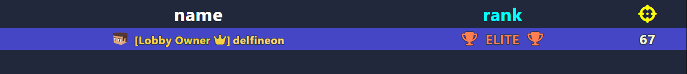

---

<div align="center">
  <h1>LOBBY LEADERBOARD</h1>
  <p>
    <a href="#api-methods"><kbd>API Methods</kbd></a> &nbsp;•&nbsp;
    <a href="#usage"><kbd>Usage</kbd></a> &nbsp;•&nbsp;
    <a href="#lobbyleaderboardinfo"><kbd>LobbyLeaderboardInfo</kbd></a> &nbsp;•&nbsp;
    <a href="#rendering"><kbd>Rendering</kbd></a> &nbsp;•&nbsp;
    <a href="#sorting"><kbd>Sorting</kbd></a> &nbsp;•&nbsp;
    <a href="#types-reference"><kbd>Types Reference</kbd></a>
  </p>
</div>

<div align="center">
  <h4>
    ✦ <code><b>Credits</b></code> ✦<br>
    <b>Information was extracted and compiled by <code>delfineonx</code></b>
  </h4>
</div>

---

<a id="api-methods"></a>
<details open>
  <summary>
    <div align="center">
      <h2>❮ <code><b>API Methods</b></code> ❯</h2>
    </div>
  </summary>

```js
/**
 * Modify a client option at runtime and send it to the client if it changed.
 *
 * @param { PlayerId } playerId
 * @param { "lobbyLeaderboardInfo" } option
 * @param { LobbyLeaderboardInfo } value
 * @returns { void }
 */
api.setClientOption(playerId, option, value);
```

```js
/**
 * Set every player's other-entity setting to a specific value for a particular entity.
 * If `includeNewJoiners = true`, new players joining later will also have this setting applied.
 *
 * @param { EntityId } targetedEntityId - player
 * @param { "lobbyLeaderboardValues" | "colorInLobbyLeaderboard" } settingName
 * @param { LobbyLeaderboardValues | string } settingValue
 * @param { boolean } [includeNewJoiners]
 * @returns { void }
 */
api.setTargetedPlayerSettingForEveryone(targetedEntityId, settingName, settingValue, includeNewJoiners);
```

</details>

---

<a id="usage"></a>
<details open>
  <summary>
    <div align="center">
      <h2>❮ <code><b>Usage</b></code> ❯</h2>
    </div>
  </summary>

`Configure columns and sorting:`

```js
api.setClientOption(playerId, "lobbyLeaderboardInfo", {
  team: {
    hidden: true,
    sortPriority: -2,
    sortOrder: "ascending"
  },
  name: {
    displayName: [{
      str: "name",
      style: {
        fontSize: "2rem",
      }
    }],
    sortPriority: 2
  },
  rank: {
    displayName: [{
      str: "rank",
      style: {
        color: "cyan",
        fontSize: "2rem"
      }
    }],
    sortPriority: 1.5
  },
  points: {
    displayName: [{
      icon: "crosshairs",
      style: {
        color: "yellow",
        fontSize: "2rem"
      }
    }],
    sortPriority: 1
  },
});
```

`Set per-player values (other-entity setting):`

```js
api.setTargetedPlayerSettingForEveryone(playerId, "lobbyLeaderboardValues", {
  team: 1,
  rank: [
  {
    icon: "trophy",
    style: {
      color: "#FF7F50",
      fontSize: "1.5rem"
    }
  },
  {
    str: "  ELITE  ",
    style: {
      color: "#FF7F50", // coral
      fontWeight: "500",
      fontSize: "1.5rem"
    }
  },
  {
    icon: "trophy",
    style: {
      color: "#FF7F50",
      fontSize: "1.5rem"
    }
  }],
  points: [{
    str: "67",
    style: {
      color: "#F5F5DC", // beige
      fontWeight: "700",
      fontSize: "1.5rem"
    }
  }],
}, true);
```

`Set per-player row highlight/background color:`

```js
api.setTargetedPlayerSettingForEveryone(playerId, "colorInLobbyLeaderboard", "#4D4DE7", true);
```

`Example result:`

<div align="center">
  
</div>

> <h3><code><b>! NOTE</b></code></h3>
> <ul>
>   <li>
>     <code>LobbyLeaderboardValues</code> describes the payload you send via the Bloxd API
>     (<code>settingName = "lobbyLeaderboardValues"</code>), which updates the client's internal leaderboard state.
>   </li>
>   <li>
>     In this documentation, that internal state is referred to as
>     <code>clientLobbyLeaderboardValues</code> to avoid confusion.
>   </li>
>   <li>
>     The client stores it per-player as
>     <code>clientLobbyLeaderboardValues[playerId][columnId]</code>
>     and may override some column ids (notably <code>"name"</code>).
>   </li>
> </ul>

</details>

---

<a id="api-methods"></a>
<details open>
  <summary>
    <div align="center">
      <h2>❮ <code><b>Client UI</b></code> ❯</h2>
    </div>
  </summary>

---

<a id="lobbyleaderboardinfo"></a>
<details open>
  <summary>
    <div align="left">
        <h3>〔 <code><b>LobbyLeaderboardInfo</b></code> 〕</h3>
    </div>
  </summary>

`LobbyLeaderboardInfo` defines the column schema and sorting logic of the leaderboard UI.

- Keys are column ids (`"name"`, `"points"`, etc.).
- Values are column configuration objects (visibility, header label, sorting parameters).
- It does not directly provide cell values — the client reads them from its internal state (`clientLobbyLeaderboardValues[playerId][columnId]`).

```ts
type LobbyLeaderboardInfo = {
  [columnId: string]: {
    hidden?: boolean
    displayName?: string | CustomTextStyling
    sortPriority?: number
    sortOrder?: "ascending" | "descending"
  }
}
```

</details>

---

<a id="rendering"></a>
<details open>
  <summary>
    <div align="left">
      <h3>〔 <code><b>Rendering</b></code> 〕</h3>
    </div>
  </summary>

<div align="left">
  <h4>⊂ <code><b>columns</b></code> ⊃</h4> 
</div>

The UI renders columns in object key order:

- `Object.keys(lobbyLeaderboardInfo)` determines the visual order.
- For each column id:
  - if `hidden === true` -> column is skipped (no header and no cells)
  - otherwise, the header text is `displayName ?? ""`

> <h3><code><b>! NOTE</b></code></h3>
> <code>sortPriority</code> affects sorting only — it does not reorder columns in the table header.<br>


<div align="left">
  <h4>⊂ <code><b>cell values</b></code> ⊃</h4> 
</div>

Internally, for each player row and each column id, the UI reads:

```js
value = clientLobbyLeaderboardValues[playerId]?.[columnId]
```

- If the value is missing / `undefined` -> the cell renders as `""` (empty).
- Sorting only compares values when both are of the same comparable type:
  - `string` vs `string`
  - `number` vs `number`

> <h3><code><b>! NOTE</b></code></h3>
> <code>clientLobbyLeaderboardValues</code> is the client-side object used for both rendering and sorting.<br>
> It is populated by the API entity setting <code>"lobbyLeaderboardValues"</code>, but the UI may also modify it (see the <code>"name"</code> special-case).<br>

<div align="left">
  <h4>⊂ <code><b>"name" special-case</b></code> ⊃</h4> 
</div>

The `"name"` column is modified by the client UI:

- The client overwrites `clientLobbyLeaderboardValues[playerId].name` with a composite structure (tags + rank + styled name + cosmetics).
- It is rendered with a custom component and is not treated as a normal leaderboard cell value.
- This behavior is specific to the `"name"` column id.

</details>

---

<a id="sorting"></a>
<details open>
  <summary>
    <div align="left">
      <h3>〔 <code><b>Sorting</b></code> 〕</h3>
    </div>
  </summary>


<div align="left">
  <h4>⊂ <code><b>Lexicographic Compare</b></code> ⊃</h4> 
</div>

Players are sorted lexicographically by the ordered column list:

- compare the first column (from the priority-sorted list)
- if it produces a difference (`diff !== 0`), sorting stops and that column decides the order
- otherwise, move to the next column (tie-breaker), and so on

Rule: the first column with `diff !== 0` decides the order.

<div align="left">
  <h4>⊂ <code><b>sortPriority</b></code> ⊃</h4> 
</div>

Before comparing players, the client builds the comparison column list:

```js
columnsByPriority = Object.keys(lobbyLeaderboardInfo);
columnsByPriority.sort((a, b) => lobbyLeaderboardInfo[a].sortPriority - lobbyLeaderboardInfo[b].sortPriority);
```

- lower `sortPriority` values are compared first
- equal `sortPriority` values have unspecified relative order

> <h3><code><b>! WARNING</b></code></h3>
> If <code>sortPriority</code> is missing/undefined, the subtraction can produce <code>NaN</code>.<br>
> That makes the final <code>columnsByPriority</code> order unspecified (engine-dependent; often it appears to fall back to the insertion order of keys).<br>
> Recommendation: set <code>sortPriority</code> explicitly for every column if you rely on own priority-based sorting.<br>

<div align="left">
  <h4>⊂ <code><b>sortOrder</b></code> ⊃</h4> 
</div>

When a non-zero `diff` is found, direction is applied like this:

```js
diff * (lobbyLeaderboardInfo[column].sortOrder === "ascending" ? 1 : -1);
```

- `"ascending"` -> ascending
- `"descending"` -> descending
- missing / any other value -> treated as descending

<div align="left">
  <h4>⊂ <code><b>Code Reference</b></code> ⊃</h4> 
</div>

```js
// client-side internal behaviour (simplified, but matches the important logic)
// info: lobbyLeaderboardInfo
// values: clientLobbyLeaderboardValues[playerId][columnId]

function compareByColumn(aVal, bVal) {
  if (typeof aVal === "string" && typeof bVal === "string") { return aVal.localeCompare(bVal); }
  if (typeof aVal === "number" && typeof bVal === "number") { return aVal - bVal; }
  return 0; // non-comparable or missing
}

function comparePlayers(aId, bId, columnsByPriority, info, values) {
  // if either player has no values object, don't reorder
  if (!values[aId] || !values[bId]) { return 0; }

  for (const column of columnsByPriority) {
    const diff = compareByColumn(values[aId][column], values[bId][column]);

    // lexicographic: first non-zero diff decides the final order
    if (diff !== 0) {
      const dir = info[column].sortOrder === "ascending" ? 1 : -1; // default: descending
      return diff * dir;
    }
  }
  return 0; // fully tied
}

function sortPlayers(playerIds, info, values) {
  const columnsByPriority = Object.keys(info);

  columnsByPriority.sort((a, b) => info[a].sortPriority - info[b].sortPriority);
  // if sortPriority is missing/undefined, subtraction can become NaN -> ordering is unspecified

  return playerIds.sort((aId, bId) => comparePlayers(aId, bId, columnsByPriority, info, values));
}
```

</details>

</details>

---

<a id="types-reference"></a>
<details open>
  <summary>
    <div align="center">
      <h2>❮ <code><b>Types Reference</b></code> ❯</h2>
    </div>
  </summary>

```ts
type LobbyLeaderboardInfo = {
  [columnId: string]: {
    hidden?: boolean
    displayName?: string | CustomTextStyling
    sortPriority?: number
    sortOrder?: "ascending" | "descending"
  }
}
```

```ts
type LobbyLeaderboardValues = {
  [columnId: string]: number | string | CustomTextStyling
}
```

```ts
type CustomTextStyling = (string | EntityName | TranslatedText | StyledIcon | StyledText)[]
```

```ts
type StyledText = {
  str: string | EntityName | TranslatedText
  style?: {
    color?: string
    colour?: string
    fontWeight?: string
    fontSize?: string
    fontStyle?: string
    opacity?: number
  }
  clickableUrl?: string
}
```

```ts
type StyledIcon = {
  icon: string
  style?: {
    color?: string
    colour?: string
    fontSize?: string
    opacity?: number
  }
}
```

```ts
type EntityName = {
  entityName: string
  style?: {
    color?: string
    colour?: string
  }
}
```

```ts
type TranslatedText = {
  translationKey: string
  params?: Record<string, string | number | boolean | EntityName>
}
```

</details>

---
