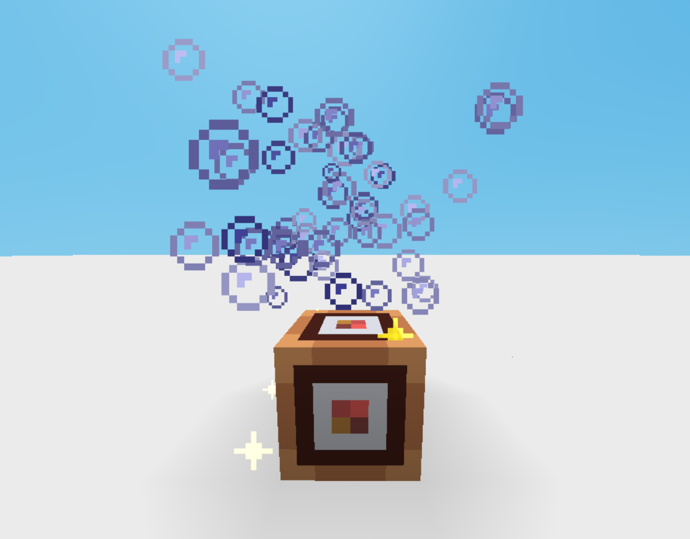

---

<div align="center">
  <h1>PARTICLES</h1>
  <p>
    <a href="#api-methods"><kbd>API Methods</kbd></a> &nbsp;•&nbsp; 
    <a href="#usage"><kbd>Usage</kbd></a> &nbsp;•&nbsp; 
    <a href="#reference"><kbd>Reference</kbd></a>
  </p>
</div>

---

<a id="api-methods"></a>
<details open>
  <summary>
    <div align="center">
      <h2>❮ <code><b>API Methods</b></code> ❯</h2>
    </div>
  </summary>

```js
/**
 * Play particle effect on all clients, or only on some clients if `clientPredictedBy` is specified.
 *
 * @param {TempParticleSystemOpts} options
 * @param {PlayerId} [clientPredictedBy]
 *   - play only on clients where client with
 *   - playerId `clientPredictedBy` is not invisible, transparent, or themselves.
 * @returns {void}
 */
playParticleEffect(options, clientPredictedBy)
```

</details>

---

<a id="usage"></a>
<details open>
  <summary>
    <div align="center">
      <h2>❮ <code><b>Usage</b></code> ❯</h2>
    </div>
  </summary>

```js
let [x, y, z] = api.thisPos;
y += 1.5;

api.playParticleEffect({
  texture: "bubble",

  pos1: [x, y, z],
  pos2: [x + 1, y + 1, z + 1],
  dir1: [-1, -1, -1],
  dir2: [1, 1, 1],
  gravity: [0, -10, 0],
  manualEmitCount: 50,
  blendMode: 1,

  minLifeTime: 0.2,
  maxLifeTime: 0.6,
  minEmitPower: 2,
  maxEmitPower: 4,
  minSize: 0.25,
  maxSize: 0.35,
  
  colorGradients: [
    {
      timeFraction: 0,
      minColor: [60, 60, 150, 1],
      maxColor: [200, 200, 255, 1],
    },
  ],

  velocityGradients: [
    {
      timeFraction: 0,
      factor: 1,
      factor2: 1,
    },
  ],
});
```

<div align="center">
  
</div>

</details>

---

<a id="reference"></a>
<details open>
  <summary>
    <div align="center">
      <h2>❮ <code><b>Reference</b></code> ❯</h2>
    </div>
  </summary>

<div align="left">
  <h3>〔 <code><b>Particle Names</b></code> 〕</h3>
</div>

```js
"bubble"
"critical_hit"
"drift"
"effect_5"
"generic_2"
"glint"
"soul_0"
"square_particle"
"heart"
"z-particle"
```

<div align="left">
  <h3>〔 <code><b>Types</b></code> 〕</h3>
</div>

```ts
type Vec3 = [number, number, number];
type Vec4 = [number, number, number, number];
```

```ts
type TempParticleSystemOptions = {
  texture: string;

  pos1: Vec3;
  pos2: Vec3;
  dir1: Vec3;
  dir2: Vec3;
  gravity: Vec3;
  manualEmitCount: number;
  hideDist: number;

  minLifeTime: number;
  maxLifeTime: number;
  minEmitPower: number;
  maxEmitPower: number;
  minSize: number;
  maxSize: number;

  width: number;
  height: number;
  depth: number;

  blendMode: ParticleSystemBlendMode;

  colorGradients: ParticleColorGradient[];
  velocityGradients: ParticleVelocityGradient[];
};
```

```ts
type ParticleColorGradient =
  | {
      timeFraction: number; // 0..1
      minColor: Vec4; // rgba (0..255, alpha 0..1)
      maxColor: Vec4;
    }
  | {
      color: Vec3;
    };
```

```ts
type ParticleVelocityGradient = {
  timeFraction: number; // 0..1
  factor: number;
  factor2: number;
};
```

```js
enum ParticleSystemBlendMode {
  // source color is added to the destination color without alpha affecting the result
  OneOne = 0,
  // blend current color and particle color using particle's alpha
  Standard = 1,
  // add current color and particle color multiplied by particle's alpha
  Add = 2,
  // multiply current color with particle color
  Multiply = 3,
  // multiply current color with particle color then add current color and particle color multiplied by particle's alpha
  MultiplyAdd = 4,
}
```

</details>

---

